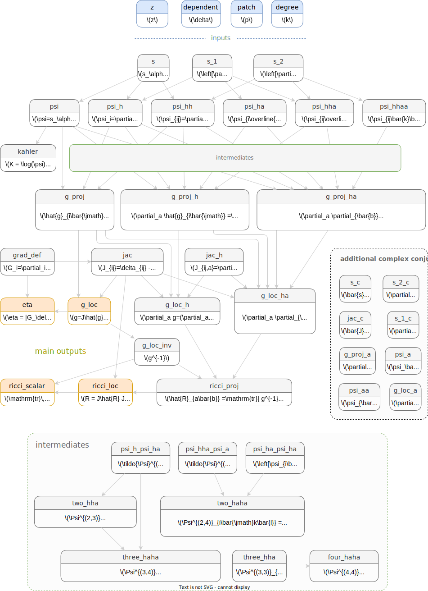

# Algebraic ansatz

The primary quantity we try to learn is the Hermitian matrix $H$ in the following algebraic ansatz for the Kähler potential:
$$
K(z, \bar{z}) = \frac{1}{\pi k} \log \left( \sum_{\alpha\bar{\beta}} s_\alpha(z) H^{\alpha \bar{\beta}} s_{\bar{\beta}}(\bar{z}) \right) \,.
$$

One has to choose what set of polynomials $s_\alpha$ to use.
For Donaldson's algorithm, these have to form a basis on the variety.
For machine learning algorithms, it is also possible to use the full set of monomials of some chosen degree in ambient projective space.
A basic algorithm to obtain a basis is implemented.
```{eval-rst}
.. currentmodule:: cyjax.donaldson

To add a numerically more advantageous choices, :class:`LBSections` can be subclassed.
```

```{eval-rst}
.. currentmodule:: cyjax

.. autosummary::

    donaldson.LBSections
    donaldson.MonomialBasisFull
    donaldson.MonomialBasisReduced
```

```{eval-rst}
.. currentmodule:: cyjax.donaldson

The components required to compute the metric, the Ricci curvature, etc. are the variety (containing the defining polynomial) and the choice of sections.
These are stored together in the :class:`AlgebraicMetric` object, which has methods to compute these quantities.
```

```{eval-rst}
.. currentmodule:: cyjax

.. autosummary::

    donaldson.AlgebraicMetric
    donaldson.AlgebraicMetric.eta
    donaldson.AlgebraicMetric.sigma_accuracy
    donaldson.AlgebraicMetric.ricci
    donaldson.AlgebraicMetric.ricci_scalar
```
g
## Internal: geometric objects

Internally, the computation of geometric objects is contained in a computational graph.
This avoids duplicate code and allows easier testing of intermediate values.
```{eval-rst}
.. currentmodule:: cyjax

.. autosummary::

    donaldson.GeometricObjects
```
Below is a summary of quantities which can be computed, for reference.



