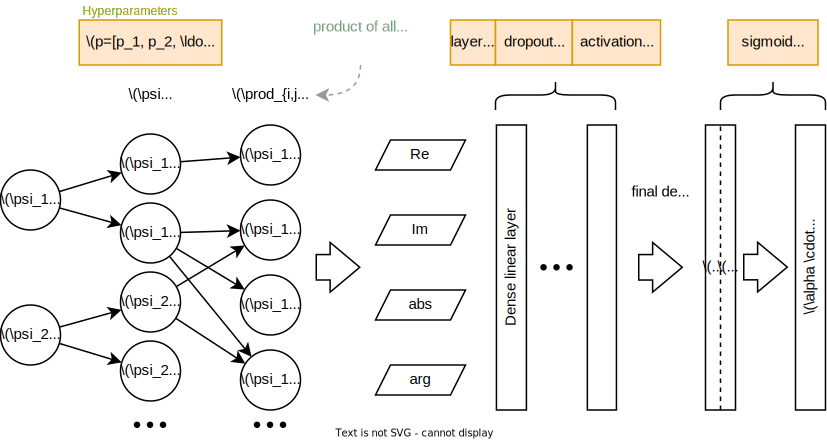

# Machine Learning

```{eval-rst}
The tools discussed in the previous sections can be used to implement a number of different machine learning approaches to approximating the Calabi-Yau metric.
Some methods for a particular approach to this using `Flax <https://github.com/google/flax>`_ can be found in the :py:mod:`cyjax.ml` submodule.
This includes functions for initializing and working with the Cholesky decomposition of the Hermitian matrix and a batched sampler class.

.. currentmodule:: cyjax

.. autosummary::

    ml.cholesky_decode
    ml.cholesky_from_param
    ml.hermitian_param_init
    ml.BatchSampler

```

One can use multiple different losses which effectively measure the Ricci-flatness of the approximated metric.
In particular, we use here the so called $\sigma$ accuracy and a Monge-Ampere loss, which rely on the property that the Ricci flat metric $g$ gives rise to a volume form which must be proportional to the one given by the holomorphic top form [(Headrick & Nassar, 2013)](https://iopscience.iop.org/article/10.1088/1742-6596/462/1/012019).
If $\Omega$ is the holomorphic top form, we can define the ratio $\eta = \frac{\det g}{\Omega \wedge \Omega}$.
The $\sigma$ accuracy measures the deviation from $\eta$ being constant as the integral

$$ \sigma = \int_X |\eta - 1| d\mathrm{vol}_{\Omega} \,. $$

For training, we use the related variance-like Monge Ampere loss

$$ \mathcal{L}_{MA} = \sum_{z \sim X} (\eta - 1)^2 w(z)\,, $$

which approximates an integral with respect to the volume form $d\mathrm{vol}_{\Omega}$ using Monte Carlo weights $w(z)$.
The latter "undo" the bias introduced by the sampling scheme used to sample points $z$ on the manifold, as discussed in a previous section.

```{eval-rst}
.. currentmodule:: cyjax

.. autosummary::

    ml.variance_eta_loss
```

Lastly, there is a configurable MLP-like network for learning the moduli dependence of the $H$ matrix.
```{eval-rst}
.. currentmodule:: cyjax

.. autosummary::

    ml.HNetMLP
```
A schematic overview of the MLP-like network is given below.

